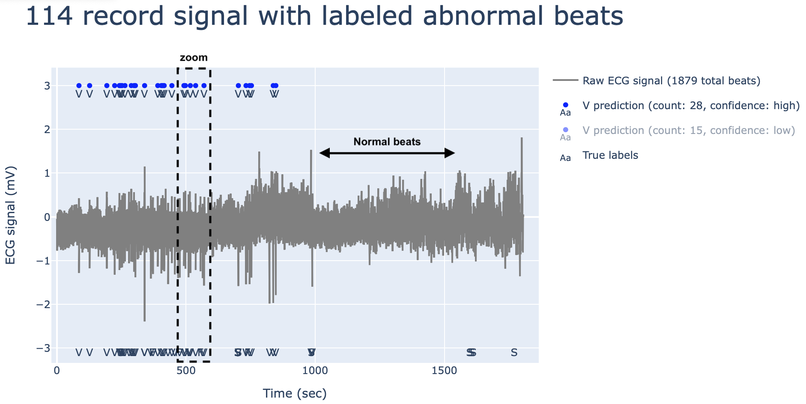
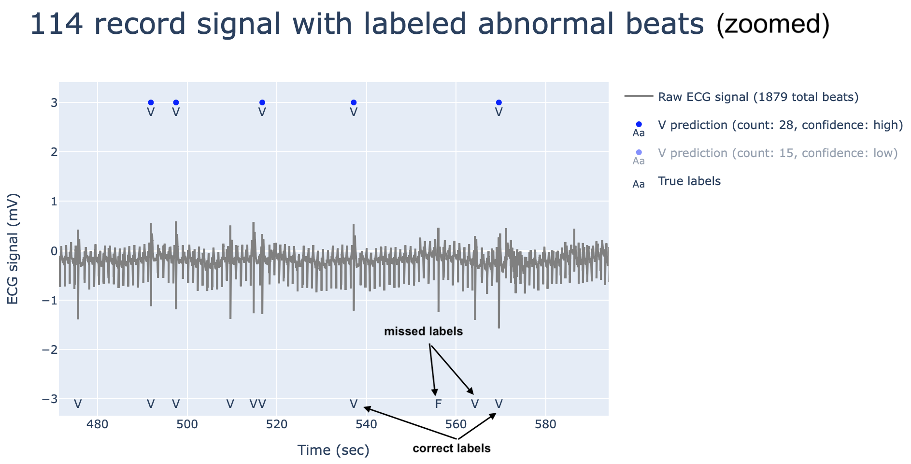
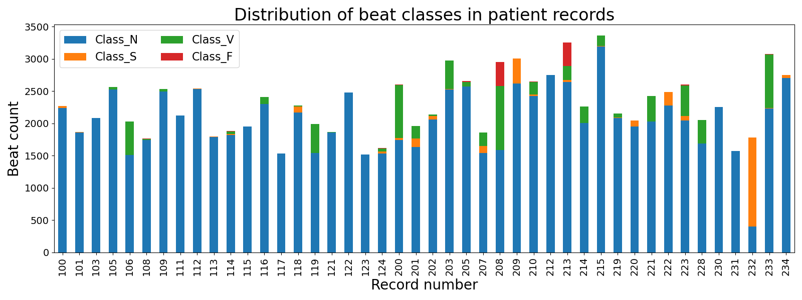
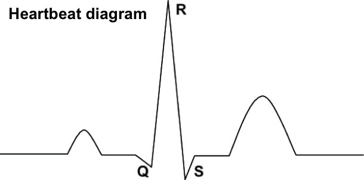
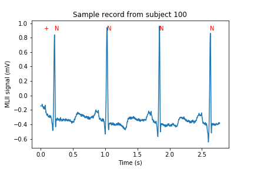
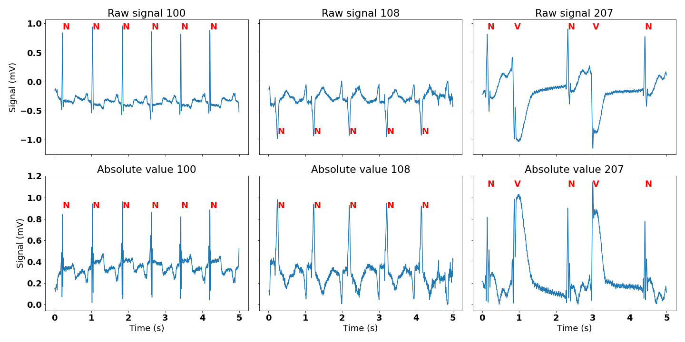
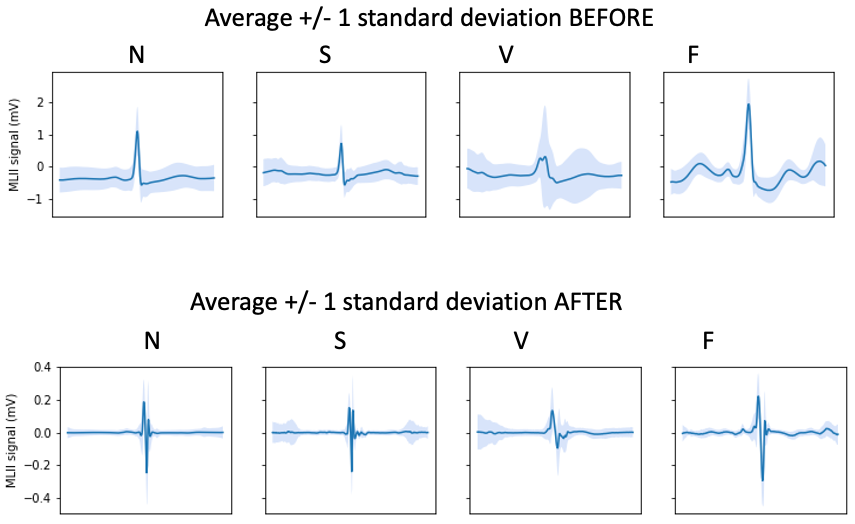
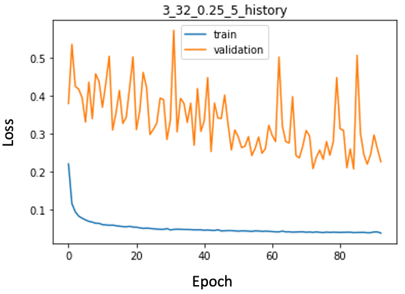
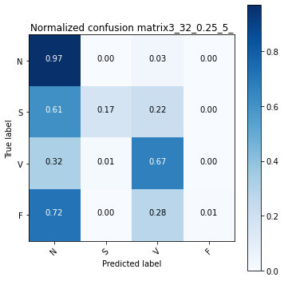

# A tool for efficient ECG record review
**Goal:** To streamline ECG record review by providing arrhythmic beat predictions.

Read the full [report](https://docs.google.com/document/d/1A7YLZp5M3NAQXLhJjCc-uEaCiXtDZwEu1opaEsnsBV4/edit?usp=sharing) and [presentation.](https://drive.google.com/file/d/1bteD6MTz_GhScgHWZbKFp2FX6kbGS7P_/view?usp=sharing)

The tool has also been deployed on [Heroku.](https://arrhytmia-detector.herokuapp.com)

Sample output from the app:

After zooming into the boxed region with abnormal beats:

**Background:** Arrhythmia diagnosis often requires doctors to review 24-48 h of ECG recordings where most of the beats are normal. This process is extremely time and labor-intensive. The present tool aims to reduce review time by automatically labeling the most likely abnormal beats. There are 5 major classes of heartbeats - N - normal, S - supraventricular ectopic beat, V - ventricular ectopic beat, F - fusion between normal and ventricular, and Q - unknown.

**Approach:** Deep learning with convolutional neural network

**Dataset:** MIT-BIH Arrhythmia dataset available at https://physionet.org/content/mitdb/1.0.0/

**Challenges:** Abnormal beats account for a minority of >90k labeled beats in the dataset. Moreover, they are unevenly distributed. A useful model should successfully identify abnormal beats in unseen patients, hence the train, validation, and test split has to be performed on records as apposed to beats. So in some sense there are only 44 distinct examples, and classes S and F are poorly represented (figure below). Note, I excluded class Q (n=15) before analysis, since there were too few samples. Also, there are technical artifacts complicating the analysis (see feature engineering).

**Feature engineering:** 
[Data exploration](Jupyter_notebooks/Processing/Data_exploration.ipynb)
[Heartbeat class exploration](Jupyter_notebooks/Processing/Class_exploration2.ipynb)
[Feature extraction](Jupyter_notebooks/Processing/Difference_feature_extraction.ipynb)

The QRS complex (heartbeat diagram below) is a prominent feature used to identify heartbeats in ECG trace. In the MIT-BIH-Arrhythmia dataset the beat annotation coordinates coincide with the QRS peak (see a sample labeled trace below). Since this project is not about ECG segmentation, I split up the signal based on beat label coordinates (+/- 0.5 sec for each annotation). This produced 360 points or features per beat (1 sec at 360 Hz frequency).

To overcome polarity inversion, a technical artifacts, I took the absolute value of the signal (see figure below).

Next to minimize baseline drift, I applied a difference transformation, which simply produces the difference of two consecutive points. In this way only the biggest changes in the signal are revealed and all the minor ones, such as the baseline drift, are silenced. See the summary graphs of raw data and after the absolute value and difference transformation.

**Dataset split**
Training set: 101, 103, 105, 106, 109, 111, 112, 113, 115, 116, 117, 119, 121, 122, 123, 200, 201, 202, 205, 207, 208, 209, 212, 219, 221, 222, 230, 231, 232, 233
Validation set: 100, 124, 215, 223
Testing set: 108, 114, 118, 203, 210, 213, 214, 220, 228, 234

| Dataset    | # of records | N count (%)  | S count (%) | V count (%) | F count (%) |
|------------|--------------|--------------|-------------|-------------|-------------|
| Train      | 30           | 59446 (88.8) | 2330 (3.5)  | 4768 (7.1)  | 403 (0.6)   |
| Validation | 4            | 9015 (91.4)  | 140 (1.4)   | 685 (6.9)   | 20 (0.2)    |
| Test       | 10           | 21664 (90.6) | 311 (1.3)   | 1556 (6.5)  | 380 (1.6)   |
| Total      | 44           | 90125 (89.5) | 2781 (2.8)  | 7009 (7.0)  | 803 (0.8)   |

**Deep learning**
[Systematic CNN tuning](Jupyter_notebooks/Model_fitting/train_val_test_systematic_CNN_fits.ipynb)
[Best model evaluation](Jupyter_notebooks/Model_fitting/CNN_best_model_evaluation.ipynb)
Trained convolutional neural nets with following parameters:
*1-4 layers 
* 16-72 nodes 
* 3-6 kernel size
* 0.2-0.5 dropout rate
untill validation F1 score did not improve any more. Next, assessed the model performance on the test set.
Following is the training history of the best performing model:

The model has high variance which is expected given the high inter-record variation and the small number of distinct records.

Here is the confusion matrix for all classes:

Although the recall for classes S anf F are small, additional 22% of S class and 28% of F class would be detected when reviewing V class predictions. Summary classification report:

| Class | Sensitivity | Precision | FPR  | Accuracy |
|-------|-------------|-----------|------|----------|
| S     | 0.17        | 0.59      | 0.02 | 0.99     |
| V     | 0.67        | 0.59      | 0.03 | 0.95     |
| F     | 0.01        | --        | --   | --       |

Overall beat class discrimination:
Specificity: 0.97
Accuracy: 0.92
